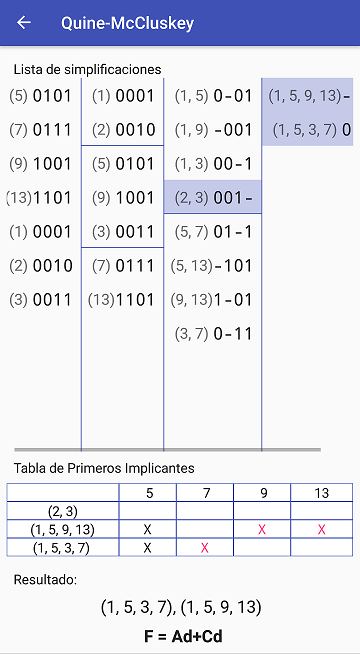

# QuineMcCluskey-APP
Android app for QuineMcCluskey algorithm.

The Quine–McCluskey algorithm (or the method of prime implicants) is a method used for minimization of Boolean functions.

More info: https://www.allaboutcircuits.com/technical-articles/everything-about-the-quine-mccluskey-method/

## Screenshots

